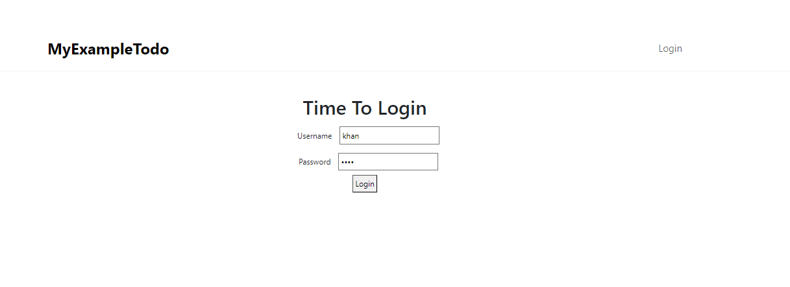
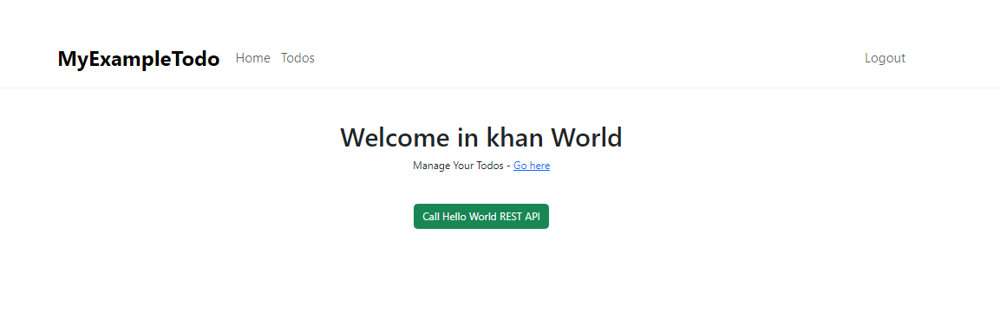
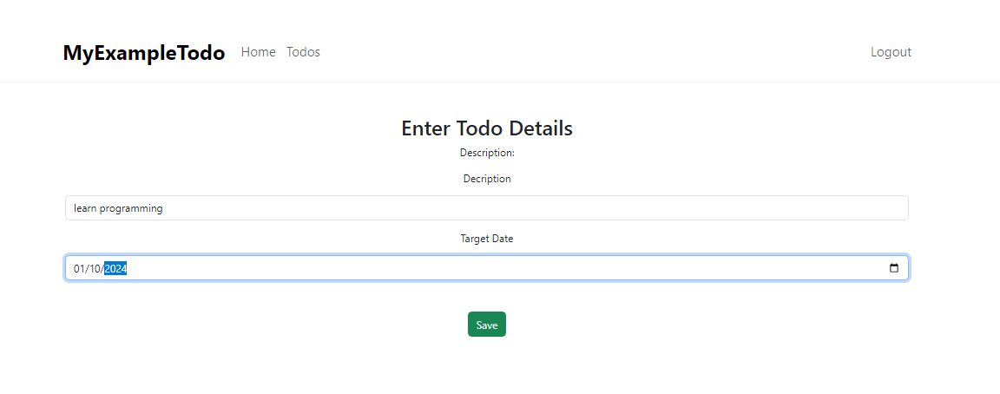
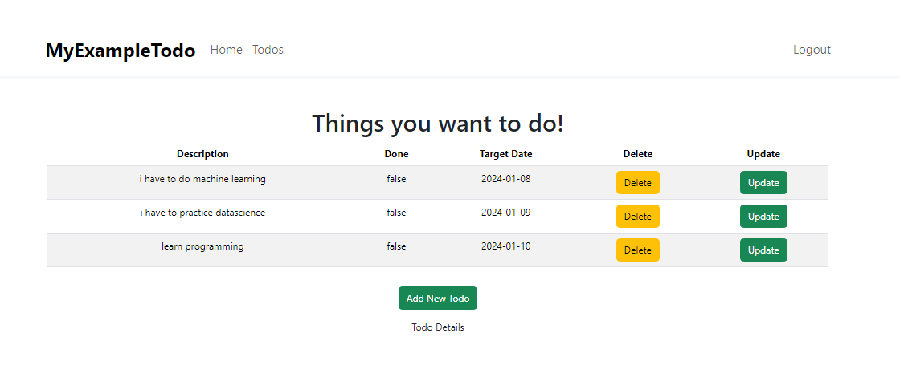

# todo-app-project-react-springBoot-

A full stack todo app used to create update delete and get the todos of the respective user.

## Technologies Used

- **Backend:** Spring Boot, Maven
- **Frontend:** React, Node.js, npm
- **Database:** mysql
- **Build Tool:** Maven

## Features

- Create, read, update, and delete (CRUD) tasks.
- User-friendly interface with React.
- RESTful API for backend communication.

